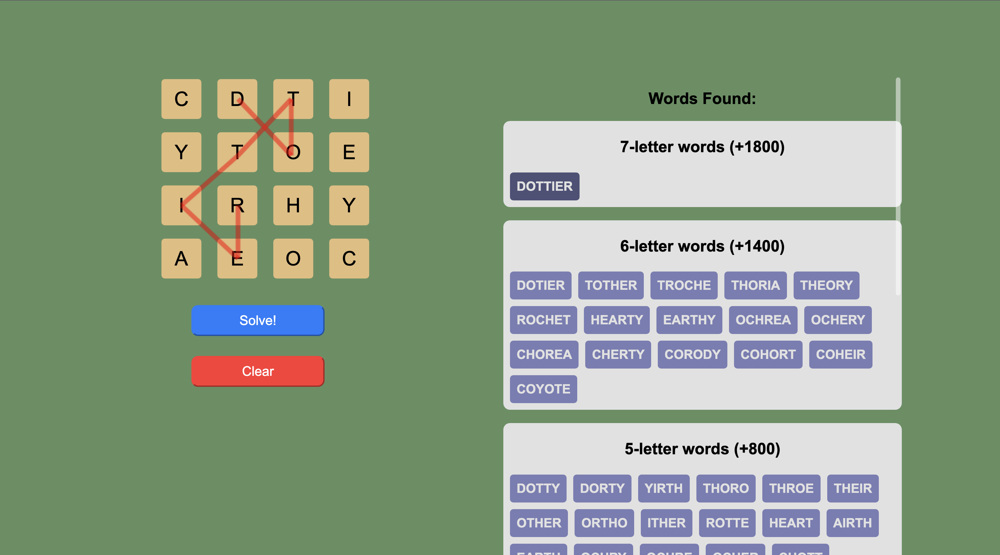

# [WordHunt-Solver](https://rsura.github.io/WordHunt-Solver/)
A simple webpage that finds the largest possible words in the iMessage game **Word Hunt** (from Game Pigeon).

## What is Word Hunt?
Word Hunt is an iMessage game available exclusively on iOS through Game Pigeon.  

## How is it played?
It’s a timed game where you slide across neighboring letters to form words. Longer words are worth more points.  

## How can I use this solver?
Just type in the letters in the order you see them into this program and click **Solve**.  
You’ll get a list of possible words ranked from longest to shortest (for maximum points).  
You can also hover over any word to see the exact path that forms it.  

## Features
- Finds all valid words based on the board you enter  
- Sorts results by word length (highest scoring first)  
- Visualizes the letter path for each word  
